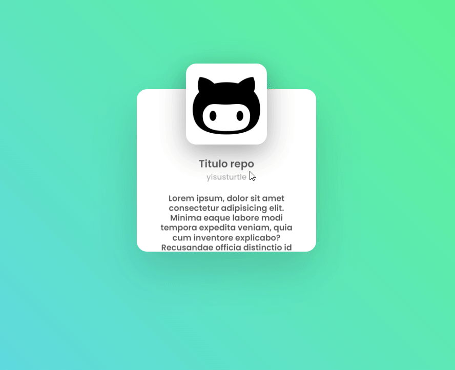
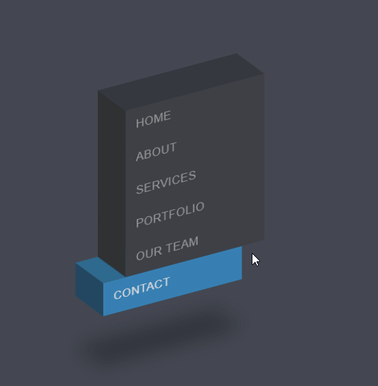
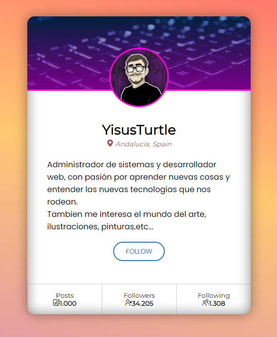

# Components design with HTML,CSS & JS
I proposed to do one component each day, and this is the result. 🤙
My idea was to grow up my abilities of webs layouts and also have components to reuse on other projects.

### List of components
* [Card github repo](#card-github-repo-go)
* [Isomtric menu](#isometric-menu-go)
* [Reto #1 ManzDev](#reto-1-manzdev-go)

### Components

* ### Card github repo
  
   
  
  [Go to repo...](https://github.com/yisusturtle/Css-Components-Styled/tree/master/card-github-repo)
* ### Isometric Menu
  
   
  
  [Go to repo...](https://github.com/yisusturtle/Css-Components-Styled/tree/master/isometric-menu)
* ### Reto #1 ManzDev
  
   
  
  [Go to repo...](https://github.com/yisusturtle/Css-Components-Styled/tree/master/reto1-manzdev)
  

